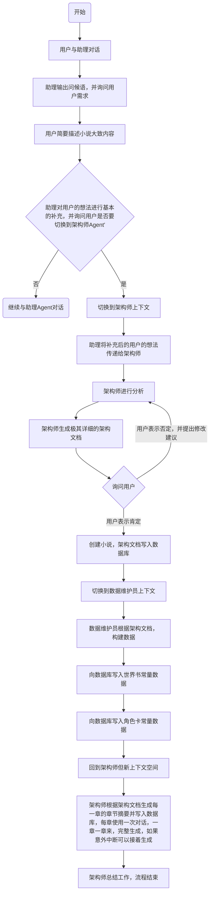
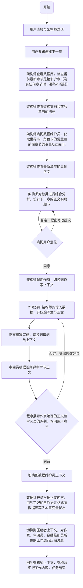

# 需求文档
## 项目介绍
搭建一个node+tsx+dotenv+openAI SDK+toml+typescript+next.js+SQLite的全栈web项目。
1. 这是一个AI内容生成系统，用于创建超长的百万字级别网络小说。项目由多个Agent协作驱动，目标是帮助非文学专业用户创建令人印象深刻的、如同真人编写的长篇网络小说。
2. 这是个人项目，使用本地开发部署。
3. 数据库能够存储小说项目，确保高性能。
4. 能使用前端网页进行交互。
5. 后端部分封装OpenAI API，只有api key存储在.env中，分别为每个Agent使用单独的toml文件来配置base url、模型、温度、推理深度、System Prompt等。base url默认为https://api.deepseek.com。
6. 所有配置文件都放在config目录。
7. 所有测试脚本都放在test目录。
8. 包含Log封装，可以输出日志文件到logs目录，文件名精确到秒。
9. 代码高度模块化，尽量拆分模块，让每个代码文件不超过300行。

## 后端设计
### Agent设计
- 所有Agent都有一个SVG头像（由LLM生成）
- 所有Agent都支持工具调用，因此本项目需要给Agent封装可用的工具
* 包含以下Agent:
1. 助理：小说生成系统的助理，对话中的默认Agent，引导用户创建小说，并提供创意。
2. 架构师：不写正文，只负责管理大纲。它根据用户的模糊指令生成分卷大纲，并确保故事走向不偏离主线。根据用户创建章节的需求，结合前后章节、架构，从数据维护员Agent那里获取所需数据，规划要传给作家Agent的prompt。架构师能够调用其他Agent，并自己编写Prompt。
3. 数据维护员：负责维护小说中的世界书和角色卡。
4. 作家：在架构师Agent的安排下，创建令人印象深刻的小说正文。
5. 审阅员：作家Agent创作完正文后，审阅员进行严格的审核，从前后逻辑一致性、文风是否符合需求、是否像真人撰写的文章、错字漏字、内容合规性等多个方面进行评估，并给出0-100的综合评分。
6. 压缩者：通用的上下文压缩Agent，能无损压缩一大段上下文并输出。

## 前端设计
- 不需要复杂的UI和动画设计，保持简洁，提高页面性能、用户可读性，并降低代码复杂度。
- 网页能适配不同设备的UI，并能与系统深色模式自适应。

### 逻辑上的页面路由概览
以下路由仅为逻辑上的区分，实际路由可按需调整。

- /login 登录页面，需要输入正确的管理员密码才可以进入系统，必须使用最高级别的加密算法确保攻击者没有办法暴力突破或绕过这个登录。可选功能：接入可以存储至谷歌账号的passkey进一步提高安全性。

- /workbench 首页，一个工作台页面，以列表展示已保存的小说项目，并能在这个页面添加新的小说项目。左侧有一个可以折叠或展开的侧边栏。侧边栏的第一项就是该工作台页面。
    
- /workbench/novel-detail 点击某个小说项目，可以进入该小说的详情页。详情页中可以编辑小说的信息（例如封面、标题、简介、作者等）。页面上以嵌套列表展示小说的分卷和分卷中的章节，分卷和章节序号能够自动维护，并能在这个页面对分卷和章节进行新增、修改、删除。也可以在这里对小说项目进行删除。**删除分卷、章节、项目需二次确认，且会转移至回收站数据库而不是直接删除**
    
- /workbench/novel-detail/design 在项目详情页点击“设计页”按钮后，进入该小说的设计页。设计页中
      
- /workbench/novel-detail/chapter 点击某个章节，进入该章节的编辑页，该页面几乎由一个带格式的文本编辑框占满，编辑框内是章节内容，编辑框的内容会实时存储在浏览器缓存中，当鼠标从编辑框失焦、或页面关闭时，能够自动保存写入数据库。每个章节的内容能够在数据库中自动维护至多10个历史版本，并提供版本切换功能。

- /chat 侧边栏的第二项，AI助理对话页面，类似chatGPT对话页面，可以增删改查对话列表，LLM可以使用本项目的定制工具来帮助用户创建小说，详见后文。

- /setting 设置页面，可以在这里对全部的配置文件进行UI友好的编辑以及热重载。对于base url，提供deepseek、openAI、openRouter的预设以进行快速切换。

### /chat页面详细设计
利用多Agent生成小说是本程序的主推功能，因此我有必要对chat页面的设计进行详细阐述。
- 所有对话默认启用流式输出（可在配置文件中关闭），如果模型支持推理，则会在llm的对话气泡上方以折叠的方式展示推理过程。
- llm的对话气泡下方会展示重试、复制按钮，就像chatGPT对话页面那样。
- 对话输入框的上方展示本轮对话已消耗的tokens，以K为单位，达到1000K时单位换为M。
- 对话与小说项目没有关联关系，让llm生成小说这件事是通过调用工具做到的。

- 以下示例展示了创建小说的典型工作流程：

- 对话输入框上方有按钮可以快速切换与不同的Agent对话，不同的Agent可以调用不同的工具
- 以下示例展示了创建正文的典型工作流程：

- 修改正文与以上流程类似。