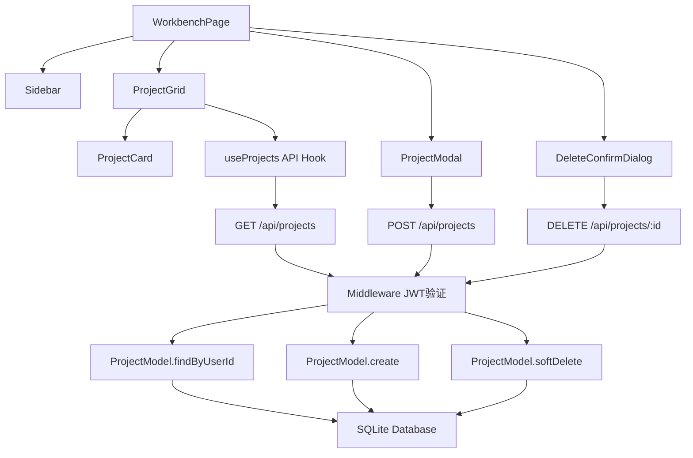
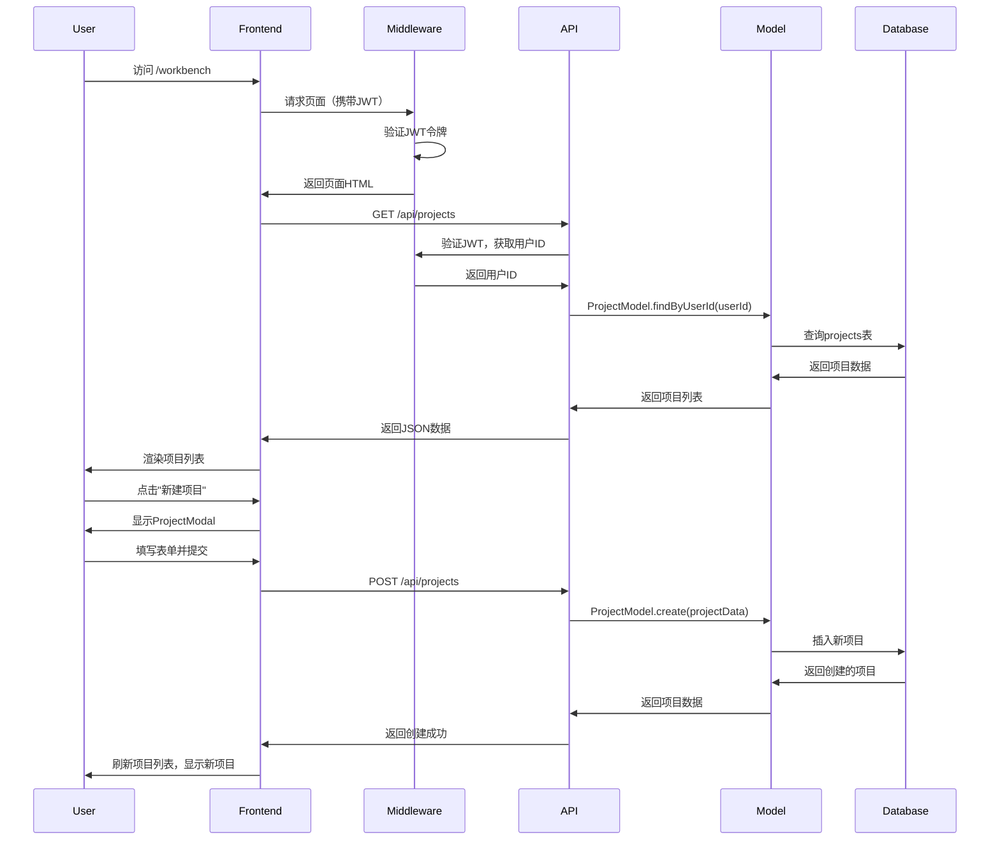

# /workbench 页面架构设计文档

## 1. 项目概述

基于现有项目进度，需要为 `/workbench` 页面设计完整的前端架构和后端 API 接口方案。工作台页面是用户登录后的主界面，需要展示用户的所有小说项目，并提供项目管理和创建功能。

## 2. 现有代码分析

### 2.1 当前工作台页面 ([`src/app/workbench/page.tsx`](src/app/workbench/page.tsx:1))
- 已有一个基本的工作台界面
- 包含项目概览、快速操作、最近活动三个卡片区域
- 项目列表表格使用硬编码数据
- 缺少与后端API的集成
- 缺少项目创建和删除功能

### 2.2 数据库模型 ([`src/db/models.ts`](src/db/models.ts:1))
- `ProjectModel` 类已实现完整的CRUD操作
- 支持软删除（`deleted_at` 字段）
- 支持按用户ID查询项目

### 2.3 认证中间件 ([`src/middleware.ts`](src/middleware.ts:1))
- 已实现JWT令牌验证
- 保护 `/workbench` 路由
- 从请求头或cookie提取令牌
- 验证失败时重定向到登录页面

### 2.4 数据库Schema ([`src/db/schema.ts`](src/db/schema.ts:1))
```typescript
interface ProjectsTable {
    id: Generated<number>;
    user_id: number;          // 用户ID
    title: string;           // 项目标题
    description: string | null; // 项目描述
    status: 'active' | 'archived'; // 项目状态
    current_chapter_id: number | null; // 当前章节ID
    created_at: Generated<Date>;
    updated_at: Generated<Date>;
    deleted_at: Date | null;  // 软删除标记
}
```

## 3. 前端UI组件架构设计

### 3.1 组件结构
```
src/app/workbench/
├── page.tsx                    # 主页面容器
├── components/
│   ├── Sidebar/               # 左侧可折叠侧边栏
│   │   ├── Sidebar.tsx
│   │   ├── SidebarItem.tsx
│   │   └── index.ts
│   ├── ProjectGrid/           # 项目列表网格组件
│   │   ├── ProjectGrid.tsx
│   │   ├── ProjectCard.tsx
│   │   └── index.ts
│   ├── ProjectModal/          # 新建项目模态框
│   │   ├── ProjectModal.tsx
│   │   └── index.ts
│   ├── DeleteConfirmDialog/   # 删除确认对话框
│   │   ├── DeleteConfirmDialog.tsx
│   │   └── index.ts
│   └── Layout/                # 页面布局组件
│       ├── MainLayout.tsx
│       └── index.ts
└── styles/
    └── workbench.css          # 工作台专用样式
```

### 3.2 组件详细设计

#### 3.2.1 Sidebar (可折叠侧边栏)
- **功能**：提供工作台导航菜单
- **菜单项**：
  1. 工作台（当前页面）
  2. AI助理（链接到 `/chat`）
  3. 设置（链接到 `/setting`）
- **特性**：
  - 支持折叠/展开
  - 响应式设计（移动端隐藏）
  - 当前页面高亮显示
  - 深色模式适配

#### 3.2.2 ProjectGrid (项目列表网格)
- **功能**：以网格形式展示用户的所有项目
- **显示信息**：
  - 项目封面（占位图）
  - 项目标题
  - 项目描述（截断显示）
  - 项目状态标签（进行中/已归档）
  - 章节数量
  - 最后更新时间
- **交互**：
  - 点击项目卡片进入详情页
  - 悬停显示操作按钮（编辑、删除）
  - 支持网格/列表视图切换

#### 3.2.3 ProjectModal (新建项目模态框)
- **功能**：创建新项目的表单对话框
- **表单字段**：
  - 项目标题（必填）
  - 项目描述（可选）
  - 项目类型（科幻、奇幻、都市等）
  - 初始状态（进行中/规划中）
- **验证**：
  - 标题不能为空
  - 标题最大长度限制
  - 描述最大长度限制

#### 3.2.4 DeleteConfirmDialog (删除确认对话框)
- **功能**：二次确认删除操作
- **内容**：
  - 确认提示信息
  - 项目名称显示
  - 警告说明（软删除，可恢复）
  - 确认/取消按钮

### 3.3 深色模式适配
- 使用CSS变量定义颜色主题
- 适配Tailwind CSS深色模式类名
- 示例CSS变量：
```css
:root {
  --sidebar-bg: #ffffff;
  --sidebar-text: #374151;
  --card-bg: #ffffff;
  --card-border: #e5e7eb;
}

.dark {
  --sidebar-bg: #1f2937;
  --sidebar-text: #f9fafb;
  --card-bg: #374151;
  --card-border: #4b5563;
}
```

## 4. 后端API接口设计

### 4.1 API端点规划
```
GET    /api/projects           # 获取用户的所有项目
POST   /api/projects           # 创建新项目
GET    /api/projects/:id       # 获取单个项目详情
PUT    /api/projects/:id       # 更新项目信息
DELETE /api/projects/:id       # 软删除项目
```

### 4.2 接口详细定义

#### 4.2.1 GET /api/projects
**功能**：获取当前用户的所有未删除项目

**请求头**：
```
Authorization: Bearer <jwt_token>
```

**响应** (200 OK)：
```json
{
  "success": true,
  "data": [
    {
      "id": 1,
      "title": "星辰之旅",
      "description": "科幻冒险小说",
      "status": "active",
      "chapter_count": 12,
      "word_count": 8456,
      "created_at": "2024-01-26T10:30:00Z",
      "updated_at": "2024-01-26T15:45:00Z"
    },
    // ... 更多项目
  ]
}
```

#### 4.2.2 POST /api/projects
**功能**：创建新项目

**请求头**：
```
Authorization: Bearer <jwt_token>
Content-Type: application/json
```

**请求体**：
```json
{
  "title": "新小说项目",
  "description": "这是一个新的小说项目描述",
  "status": "active"
}
```

**响应** (201 Created)：
```json
{
  "success": true,
  "data": {
    "id": 123,
    "title": "新小说项目",
    "description": "这是一个新的小说项目描述",
    "status": "active",
    "user_id": 1,
    "created_at": "2024-01-27T09:30:00Z",
    "updated_at": "2024-01-27T09:30:00Z"
  }
}
```

#### 4.2.3 DELETE /api/projects/:id
**功能**：软删除项目（更新 `deleted_at` 字段）

**请求头**：
```
Authorization: Bearer <jwt_token>
```

**响应** (200 OK)：
```json
{
  "success": true,
  "message": "项目已删除",
  "data": {
    "id": 123,
    "deleted_at": "2024-01-27T09:35:00Z"
  }
}
```

### 4.3 认证与授权
- 所有API端点都需要JWT令牌认证
- 使用现有中间件 [`src/middleware.ts`](src/middleware.ts:1) 进行验证
- 从请求头提取用户ID：`request.headers.get('x-user-id')`
- 确保用户只能操作自己的项目

## 5. 组件关系与数据流

### 5.1 组件关系图


### 5.2 数据流程图


## 6. 实现步骤与优先级

### 6.1 第一阶段：基础API实现
1. 创建 `src/app/api/projects/route.ts` - GET接口
2. 创建 `src/app/api/projects/route.ts` - POST接口  
3. 创建 `src/app/api/projects/[id]/route.ts` - DELETE接口
4. 更新中间件，确保API端点受保护

### 6.2 第二阶段：前端组件重构
1. 重构 `src/app/workbench/page.tsx` 为容器组件
2. 创建侧边栏组件 `Sidebar`
3. 创建项目网格组件 `ProjectGrid`
4. 集成API数据获取

### 6.3 第三阶段：交互功能实现
1. 创建 `ProjectModal` 组件
2. 创建 `DeleteConfirmDialog` 组件
3. 实现项目创建功能
4. 实现项目删除功能
5. 添加加载状态和错误处理

### 6.4 第四阶段：优化与测试
1. 添加深色模式支持
2. 优化响应式设计
3. 添加单元测试
4. 性能优化（虚拟滚动等）

## 7. 技术细节

### 7.1 状态管理
- 使用React状态管理项目数据
- 使用SWR或React Query进行数据缓存
- 本地状态管理表单数据

### 7.2 错误处理
- API错误统一格式：`{ success: false, error: "错误信息" }`
- 前端显示友好的错误提示
- 网络错误重试机制

### 7.3 性能优化
- 项目列表分页加载
- 图片懒加载
- 组件代码分割
- 防抖搜索功能

### 7.4 安全性考虑
- JWT令牌有效期管理
- XSS防护（React自动转义）
- CSRF保护（SameSite Cookie）
- 输入验证和清理

## 8. 与现有系统的集成点

### 8.1 认证集成
- 使用现有JWT验证中间件
- 复用 `verifyToken` 函数
- 保持一致的错误响应格式

### 8.2 数据库集成
- 使用现有 `ProjectModel` 类
- 复用数据库连接池
- 保持软删除逻辑一致

### 8.3 样式集成
- 使用现有Tailwind CSS配置
- 复用颜色主题和设计系统
- 保持UI风格一致

## 9. 验收标准

### 9.1 功能验收
- [ ] 用户登录后可以访问工作台页面
- [ ] 页面显示用户的所有项目
- [ ] 点击"新建项目"可以创建新项目
- [ ] 点击删除按钮可以软删除项目
- [ ] 侧边栏可以折叠/展开
- [ ] 页面适配深色模式

### 9.2 性能验收
- [ ] 页面加载时间 < 2秒
- [ ] API响应时间 < 500ms
- [ ] 移动端体验良好
- [ ] 内存使用合理

### 9.3 安全验收
- [ ] 未登录用户无法访问工作台
- [ ] 用户只能操作自己的项目
- [ ] API端点都有JWT验证
- [ ] 输入数据经过验证

## 10. 风险与缓解措施

### 10.1 技术风险
- **风险**：API性能问题
- **缓解**：实现分页，添加数据库索引

- **风险**：JWT令牌管理复杂
- **缓解**：复用现有中间件，保持简单

### 10.2 业务风险
- **风险**：用户误删除项目
- **缓解**：实现软删除，添加回收站功能

- **风险**：数据不一致
- **缓解**：使用数据库事务，添加数据验证

---

**文档版本**: 1.0  
**创建日期**: 2026-01-27  
**最后更新**: 2026-01-27  
**负责人**: 架构师